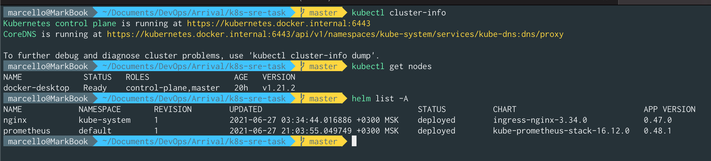
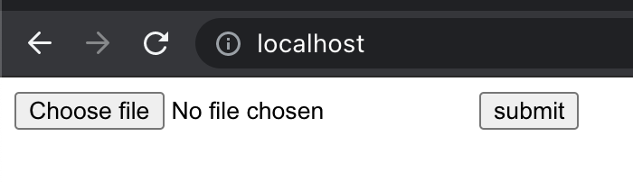
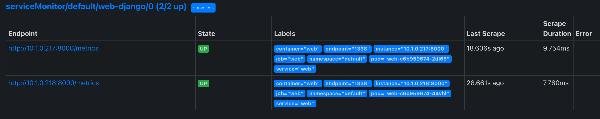
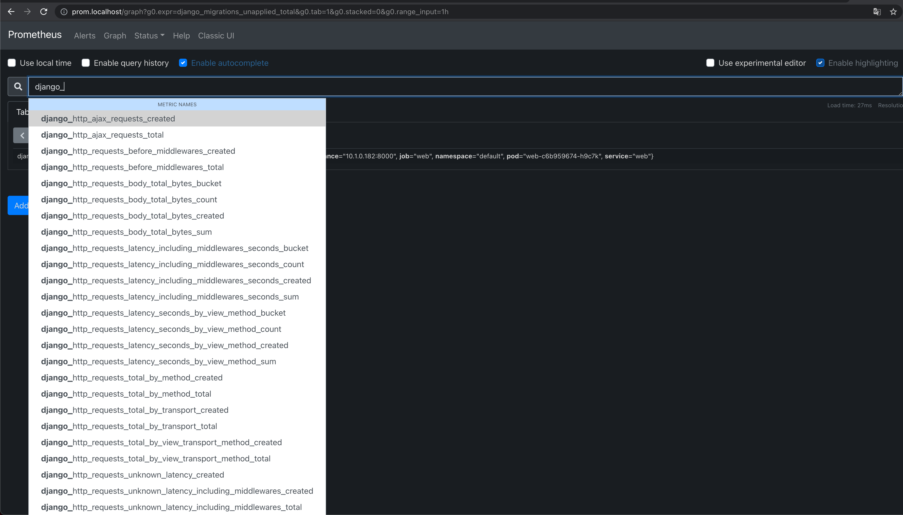

# Solution (Must-have part)

Dock^W Kuberized Django with Postgres, Gunicorn, and Nginx

1. Build images "web" and "nginx" (or use already builded images after docker-compose build) the images and push to registry [hub.docker.com](https://hub.docker.com/u/vinduzyatnik) as

    ```sh
    vinduzyatnik/k8s-sre-task_nginx
    vinduzyatnik/k8s-sre-task_web
    ```

2. Spin up docker-desktop kubernetes one node cluster.


3. Install "ingress-nginx" and "kube-prometheus-stack" helm charts.




4. Deploy app inside this repo via

    ```sh
    $ kubectl apply -f .
    ```

    Test it out at [http://localhost].



6. Metrics available in prometheus.






5. PROFIT!!!!!11
